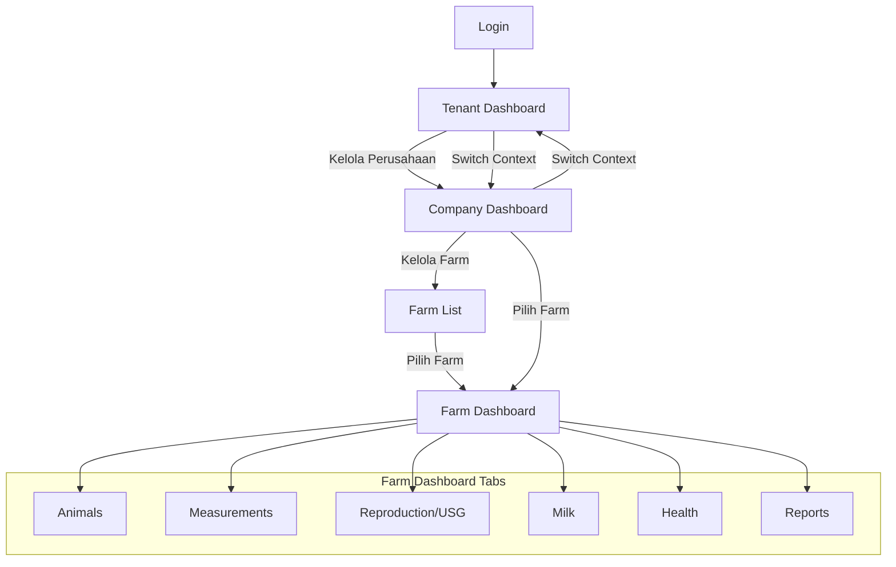
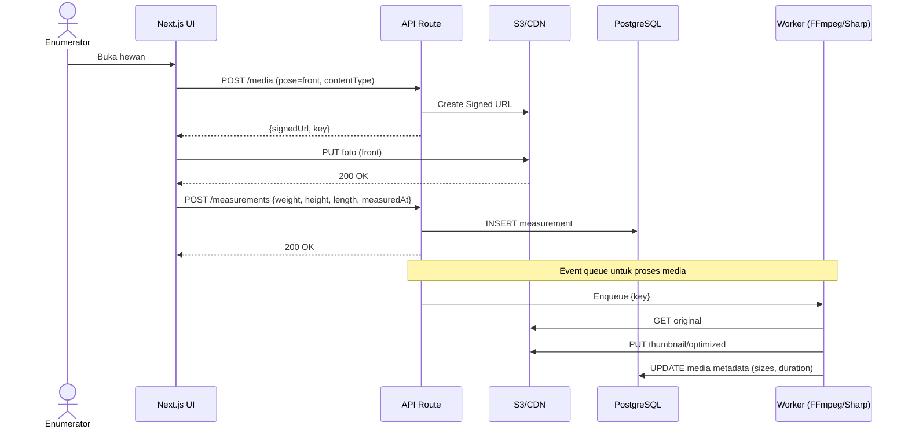
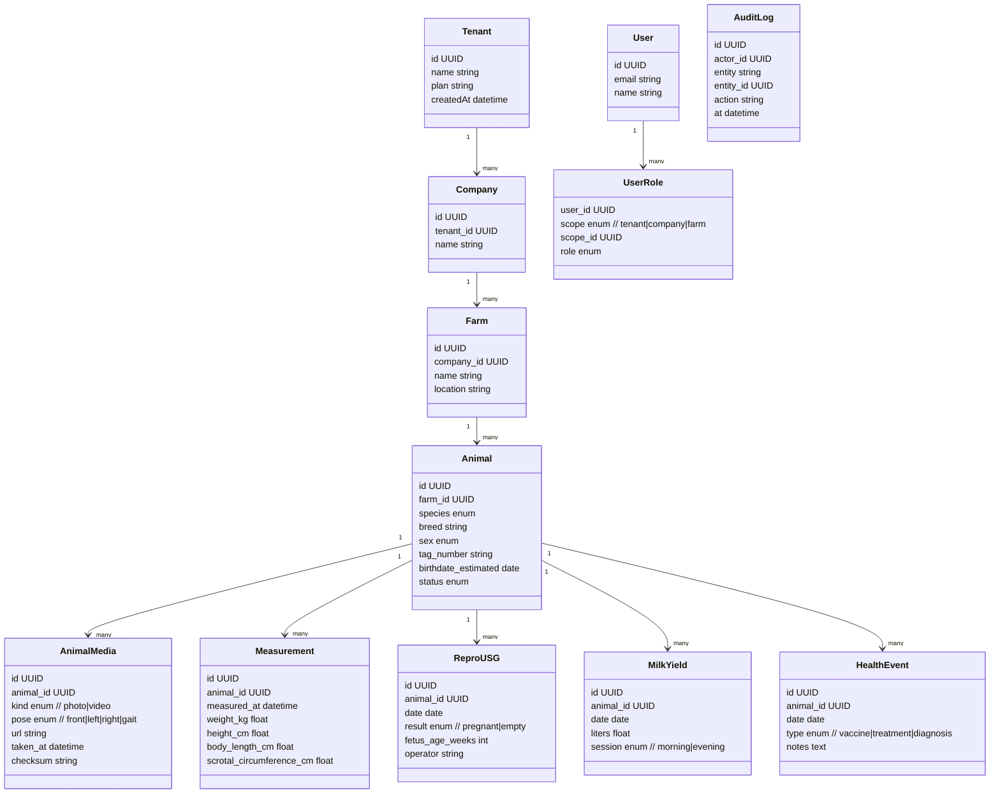
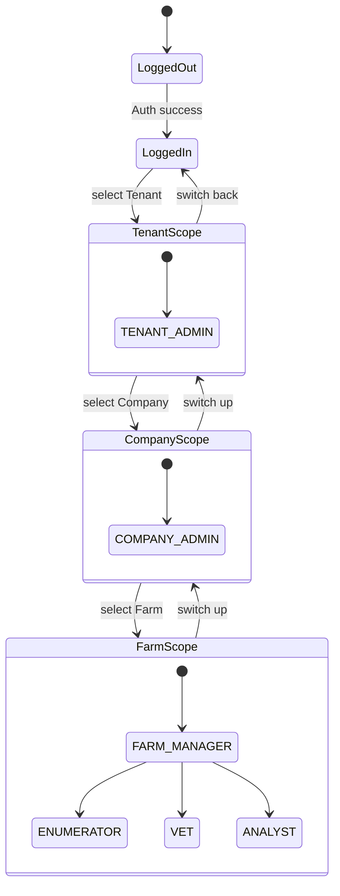
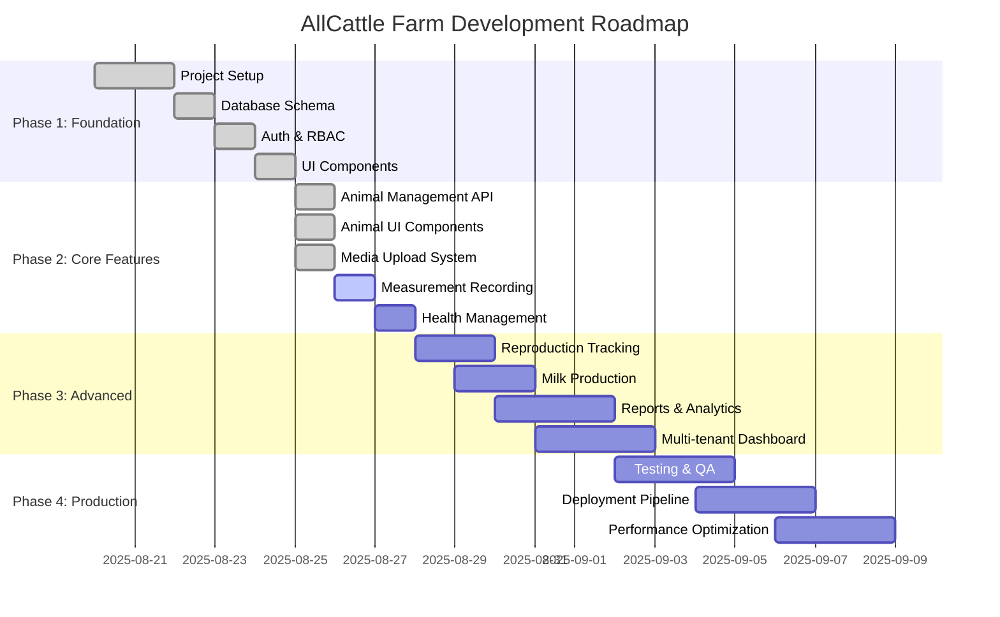

# Sistem Monitoring Hewan — Blueprint Teknis + Wireframe

> Dokumen ini menggabungkan kebutuhan bisnis, arsitektur teknis (Next.js, Tailwind, dsb.), model data, API, pipeline media, RBAC, hingga wireframe (Mermaid). Siap untuk dijadikan acuan implementasi.

Domain: allcattle.farm
Location: Singapore
OS: Ubuntu 22.04 x64
vCPU/s: 2 vCPUs
RAM: 4096.00 MB
Storage: 80 GB SSD
IP Address: 139.180.186.21 
Username: root
Password: 6Rc)74b9@?+{yNAT

npx prisma db push
npm run db:seed

Script Multi Tenant ambil darisini: https://github.com/stack-auth/multi-tenant-starter-template.git
---

## Daftar Isi
1. [Ringkasan Bisnis & Hirarki](#### ✅ COMPLETED (Phase 2: Core Features - 100%)

#### 6. API Development ✅
- [x] Auth routes (src/app/api/auth/[...nextauth]/route.ts)
- [x] Stack Auth handler (src/app/handler/[...stack]/route.ts)
- [x] Complete animals CRUD API (src/app/api/animals/route.ts)
- [x] Individual animal operations (src/app/api/animals/[animalId]/route.ts)
- [x] Measurements API (src/app/api/animals/[animalId]/measurements/route.ts)
- [x] Media upload API with signed URLs (src/app/api/animals/[animalId]/media/route.ts)
- [x] Health events API (src/app/api/animals/[animalId]/health/route.ts)
- [x] Individual health event operations (src/app/api/animals/[animalId]/health/[eventId]/route.ts)
- [x] Reproduction USG API (src/app/api/animals/[animalId]/reproduction/usg/route.ts)
- [x] Individual USG record operations (src/app/api/animals/[animalId]/reproduction/usg/[usgId]/route.ts)
- [x] Milk production API (src/app/api/animals/[animalId]/milk/route.ts)

#### 7. Animal Management System ✅
- [x] Complete animal data structure
- [x] Animal list/grid component (src/components/animals/animal-list.tsx)
- [x] Animal form component (src/components/animals/animal-form.tsx)
- [x] Animals page with CRUD operations (src/app/animals/page.tsx)
- [x] Animal detail view page (src/app/animals/[animalId]/page.tsx)
- [x] Search & filtering functionality
- [x] Responsive design with loading states

#### 8. UI Component Library ✅
- [x] shadcn/ui base components (Button, Card, Input, Label)
- [x] Advanced form components (Select, Textarea, Calendar, Popover, Tabs)
- [x] Badge component for status display
- [x] Form validation with React Hook Form + Zod
- [x] Date picker integration
- [x] Measurement form component (src/components/measurements/measurement-form.tsx)

#### 9. Measurement Recording System ✅
- [x] Measurement API with validation
- [x] Measurement form component with business rules
- [x] Species-specific validations (scrotal circumference)
- [x] Date/time picker integration
- [x] Measurement history display in animal detail

#### 10. Health Management System ✅
- [x] Health events API with comprehensive validation
- [x] Individual health event CRUD operations
- [x] Health event form component (src/components/health/health-event-form.tsx)
- [x] Health event list component (src/components/health/health-event-list.tsx)
- [x] Health dashboard component (src/components/health/health-dashboard.tsx)
- [x] Business rule validations (vaccination intervals, overdue alerts)
- [x] Integration with animal detail page
- [x] Event type categorization (vaccination, treatment, checkup, surgery, medication, observation)
- [x] Status tracking (scheduled, completed, cancelled)
- [x] Due date management and overdue alerts

#### 11. Reproduction Tracking System ✅
- [x] USG records API with comprehensive validation
- [x] Individual USG record CRUD operations
- [x] USG form component (src/components/reproduction/usg-form.tsx)
- [x] USG list component (src/components/reproduction/usg-list.tsx)
- [x] Pregnancy status tracking and calculations
- [x] Business rule validations (female-only, fetus age requirements)
- [x] Integration with animal detail page (female animals only)
- [x] Due date calculations and overdue alerts
- [x] Pregnancy summary dashboard
- [x] Result categorization (pregnant, empty, unclear)

#### 12. Milk Production Management System ✅
- [x] Milk yield API with comprehensive validation and statistics
- [x] Milk yield form component (src/components/milk/milk-yield-form.tsx)
- [x] Milk yield list component (src/components/milk/milk-yield-list.tsx)
- [x] Production statistics and trend analysis
- [x] Business rule validations (dairy species only, production limits)
- [x] Integration with animal detail page (cattle and goat only)
- [x] Session tracking (morning/evening milking)
- [x] Quality assessment and recording
- [x] Daily production grouping and visualizationhirarki)
2. [Peran & Akses](#2-peran--akses)
3. [Entitas & Data Inti](#3-entitas--data-inti)
4. [Validasi & Aturan Data](#4-validasi--aturan-data)
5. [Stack & Arsitektur Teknis](#5-stack--arsitektur-teknis)
6. [API (Contoh Ringkas)](#6-api-contoh-ringkas)
7. [Struktur Data (Inti)](#7-struktur-data-inti)
8. [Media Pipeline (Foto/Video)](#8-media-pipeline-fotovideo)
9. [Otomasi & Notifikasi](#9-otomasi--notifikasi)
10. [Keamanan & Performa](#10-keamanan--performa)
11. [CI/CD, Testing & DevEx](#11-cicd-testing--devex)
12. [Struktur Folder (App Router)](#12-struktur-folder-app-router)
13. [Contoh Kode (RBAC & Signed URL)](#13-contoh-kode-rbac--signed-url)
14. [Wireframe & Diagram (Mermaid)](#14-wireframe--diagram-mermaid)
15. [Roadmap Ekstensi](#15-roadmap-ekstensi)

---

## 1) Ringkasan Bisnis & Hirarki
- **Superadmin**: membuat & mengelola **Tenant** (paket, limit, billing, audit).
- **Tenant**: bisa punya **beberapa Perusahaan**; **switch context** Tenant ⇄ Perusahaan.
- **Perusahaan**: membawahi **beberapa Farm**; atur SOP, integrasi alat.
- **Farm**: operasional harian data hewan.

**Alur Operasional Farm (high-level)**
- Onboarding hewan → foto 3 posisi + video gait → identitas & umur (gigi) → pengukuran awal.
- Pencatatan rutin: timbang/ukur, USG (betina), produksi susu, kesehatan.
- Rekap & laporan lintas farm/perusahaan/tenant.

---

## 2) Peran & Akses
- Global: `SUPERADMIN`
- Tenant: `TENANT_ADMIN`
- Perusahaan: `COMPANY_ADMIN`
- Farm: `FARM_MANAGER`, `ENUMERATOR`, `VET`, `ANALYST`

**Scope & Isolasi**
- Kolom `tenant_id`, `company_id` pada tabel utama.
- Opsional **Postgres RLS**: policy `user.tenant_id = record.tenant_id`.
- Context Switcher: header `X-Tenant-Id`, `X-Company-Id`, `X-Farm-Id`.

---

## 3) Entitas & Data Inti
- **Hewan**: spesies (sapi, domba, kambing, kerbau, kuda, unta, llama), breed, sex, tag, umur (gigi), status.
- **Media**: foto 3 posisi (depan/kiri/kanan), video berjalan (gait).
- **Pengukuran**: berat, tinggi, panjang badan, **lingkar testis (jantan)**.
- **Reproduksi (betina)**: hasil **USG** (status bunting, umur kebuntingan, operator).
- **Produksi susu**: sapi/kambing perah (harian; sesi pagi/sore).
- **Kesehatan**: vaksin, diagnosis, tindakan, obat.
- **Laporan**: populasi, struktur umur/sex, tren berat & ADG, tingkat kebuntingan, produksi susu, mortalitas, kepatuhan input.

---

## 4) Validasi & Aturan Data
- **Nomor tag unik** per Farm (opsi: unik tenant-wide).
- **Lingkar testis**: hanya untuk **jantan** & spesies relevan.
- **USG**: hanya untuk **betina**.
- **Produksi susu**: hanya spesies perah (sapi/kambing perah).
- **Satuan**: kg, cm, liter; **foto ≤ 10 MB**, **video ≤ 200 MB** (konfigurabel).
- **Kelengkapan media**: enforce foto 3 sisi + video gait saat onboarding.

---

## 5) Stack & Arsitektur Teknis
- **Full-stack**: Next.js (App Router) + TypeScript
- **UI**: Tailwind CSS + **shadcn/ui** + Radix UI
- **Form/Validasi**: React Hook Form + Zod
- **Data fetching**: TanStack Query (client) + server actions/route handlers
- **Auth & Multi-tenant**: Auth.js (NextAuth) + JWT + RBAC + context headers
- **Database**: PostgreSQL + Prisma (opsional **RLS**)
- **Media**: S3-compatible (AWS S3/Cloudflare R2) + CDN (signed URL)
- **Jobs/Queue**: Inngest / BullMQ (Redis) — transcode, thumbnail, agregasi laporan
- **Realtime/Devices**: MQTT broker (EMQX/Mosquitto), Webhook HTTPS, WebSocket
- **Observability**: Sentry (error), OpenTelemetry (tracing), ELK/Logtail (log), Prometheus+Grafana (metrics)
- **CI/CD**: GitHub Actions → Vercel (web) + Fly.io/Railway (workers)
- **Security**: CSP/HSTS, Upstash rate limit, token rotasi, SSE-KMS (S3)

---

## 6) API (Contoh Ringkas)
- `POST /api/admin/tenants`
- `POST /api/tenants/:tenantId/companies`
- `POST /api/companies/:companyId/farms`
- `POST /api/farms/:farmId/animals`
- `POST /api/animals/:animalId/media` (`pose=front|left|right|gait`)
- `POST /api/animals/:animalId/measurements`
- `POST /api/animals/:animalId/reproduction/usg`
- `POST /api/animals/:animalId/milk`
- `GET  /api/reports?scope=farm|company|tenant&from=&to=&species=&...`

**Zod Validasi (contoh measurement)**
```ts
const measurementSchema = z.object({
  weightKg: z.number().min(0).max(2000).optional(),
  heightCm: z.number().min(0).max(300).optional(),
  bodyLengthCm: z.number().min(0).max(400).optional(),
  scrotalCircumferenceCm: z.number().min(0).max(60).optional(), // tampil jika sex=jantan
  measuredAt: z.string().datetime(),
});
````

---

## 7) Struktur Data (Inti)

* `tenants`, `companies(tenant_id)`, `farms(company_id)`
* `users`, `roles`, `user_roles(scope, scope_id, role)`
* `animals(farm_id, species, breed, sex, tag_number, birthdate_estimated, status)`
* `animal_media(animal_id, kind photo|video, pose front|left|right|gait, url, taken_at, checksum)`
* `measurements(animal_id, measured_at, weight_kg, height_cm, body_length_cm, scrotal_circumference_cm)`
* `repro_usg(animal_id, date, result pregnant|empty, fetus_age_weeks, operator)`
* `milk_yield(animal_id, date, liters, session morning|evening)`
* `health_events(animal_id, date, type vaccine|treatment|diagnosis, notes)`
* `audit_logs(actor_id, entity, entity_id, action, before, after, at)`

**Indeks & Praktik**

* Unik: `animals(farm_id, tag_number)`
* Time-series: indeks pada `measured_at`, `date`
* Partisi per tanggal (opsional untuk tabel besar)

---

## 8) Media Pipeline (Foto/Video)

* **Upload langsung ke S3** via **Signed URL** (minim beban server).
* **Foto**: worker (Sharp) → thumbnail + kompresi.
* **Video gait**: FFmpeg → HLS (`.m3u8`) + poster thumbnail; streaming via CDN.
* **Penamaan**: `/tenant/{t}/company/{c}/farm/{f}/animal/{a}/{ts}_{pose}.jpg`
* **Akses**: bucket private + signed URL/tokenized CDN.
* **Checksum**: simpan untuk dedupe & verifikasi integritas.

---

## 9) Otomasi & Notifikasi

* **Scheduler (Inngest/cron)**:

  * Reminder timbang (mis. tiap 30 hari).
  * Jadwal USG & vaksin berikutnya.
  * Agregasi KPI harian/mingguan untuk farm/company/tenant.
* **Alert**:

  * Berat turun > X% dalam N hari.
  * Produksi susu anjlok signifikan.
  * Media onboarding tidak lengkap.
* **Kanal**: email, web push, WhatsApp gateway (opsional).

---

## 10) Keamanan & Performa

* **Auth**: short-lived access token + refresh; rotasi secret.
* **RBAC**: cek scope di setiap query/mutasi (server-side).
* **Rate Limiting**: per IP & per user (Upstash/Redis).
* **Headers**: CSP, HSTS, X-Frame-Options, COOP/COEP.
* **PII**: minimisasi; enkripsi at-rest (S3 SSE-KMS) & in-transit (TLS).
* **Caching**: TanStack Query; Redis; ISR/segment caching.
* **Pagination**: cursor-based untuk tabel besar.
* **Storage lifecycle**: arsip >90 hari ke kelas storage murah.

---

## 11) CI/CD, Testing & DevEx

* **Monorepo**: Turborepo (`apps/web`, `packages/ui`, `packages/config`).
* **Lint/Format**: ESLint + Prettier + TypeScript strict.
* **Testing**:

  * Unit: Vitest
  * e2e: Playwright
  * Contract: Pact (opsional)
* **GitHub Actions**:

  * Lint/Test → Build → Preview → Deploy
* **Secrets**: `dotenv-vault` / platform secrets manager.

---

## 12) Struktur Folder (App Router)

```
apps/web/
  app/
    (auth)/sign-in/page.tsx
    (dashboard)/tenant/page.tsx
    (dashboard)/company/page.tsx
    (dashboard)/farm/page.tsx
    animals/[animalId]/page.tsx
    api/
      animals/[animalId]/media/route.ts
      animals/[animalId]/measurements/route.ts
      animals/[animalId]/reproduction/usg/route.ts
      animals/[animalId]/milk/route.ts
      reports/route.ts
  components/
    ui/
    forms/
    tables/
  lib/
    auth.ts
    rbac.ts
    prisma.ts
    s3.ts
    mqtt.ts
    validators/
  prisma/
    schema.prisma
  styles/
```

---

## 13) Contoh Kode (RBAC & Signed URL)

**RBAC Guard (server)**

```ts
// lib/rbac.ts
export function ensureScope(
  user: { memberships: { scope: "tenant"|"company"|"farm"; scopeId: string; role: string }[] },
  scope: "tenant"|"company"|"farm",
  scopeId: string,
  roles: string[]
) {
  const ok = user.memberships.some(m => m.scope === scope && m.scopeId === scopeId && roles.includes(m.role));
  if (!ok) throw new Error("Forbidden");
}
```

**Signed URL Upload (foto)**

```ts
// app/api/animals/[animalId]/media/route.ts
import { NextResponse } from "next/server";
import { z } from "zod";
import { s3CreatePresignedPut } from "@/lib/s3";
import { ensureScope } from "@/lib/rbac";

const bodySchema = z.object({
  pose: z.enum(["front","left","right","gait"]),
  contentType: z.string().startsWith("image/"),
  tenantId: z.string(),
  companyId: z.string(),
  farmId: z.string(),
});

export async function POST(req: Request, { params }: { params: { animalId: string } }) {
  const body = bodySchema.parse(await req.json());
  // TODO: get user from auth session
  // ensureScope(user, "farm", body.farmId, ["FARM_MANAGER","ENUMERATOR"]);
  const key = `tenant/${body.tenantId}/company/${body.companyId}/farm/${body.farmId}/animal/${params.animalId}/${Date.now()}_${body.pose}.jpg`;
  const { url, fields } = await s3CreatePresignedPut({ key, contentType: body.contentType });
  return NextResponse.json({ url, fields, key });
}
```

---

## 14) Wireframe & Diagram (Mermaid)

### A) System Context & Data Flow

```mermaid
flowchart LR
  subgraph User[Pengguna]
    U1[Superadmin]
    U2[Tenant Admin]
    U3[Company Admin]
    U4[Farm Roles\nManager/Enumerator/Vet/Analyst]
  end

  subgraph Web[Next.js App (Vercel)]
    UI[UI: Tailwind + shadcn]
    Auth[Auth.js\nSession/JWT]
    API[Route Handlers / Server Actions]
    WS[WebSocket]
  end

  subgraph Core[Core Services]
    DB[(PostgreSQL\nPrisma + RLS)]
    STORE[(S3 + CDN)]
    QUEUE[(Redis Queue)]
    JOBS[Workers\n(Transcode, Thumbnail, Reports)]
    MQTT[(MQTT Broker)]
    OBS[(Sentry/Otel/Logs)]
  end

  U1--HTTP/S-->UI
  U2--HTTP/S-->UI
  U3--HTTP/S-->UI
  U4--HTTP/S-->UI

  UI--Auth-->Auth
  UI--API calls-->API
  API--SQL-->DB
  API--Signed URL-->STORE
  API--Pub/Sub-->QUEUE
  API--WS-->WS
  JOBS--read/write-->DB
  JOBS--media ops-->STORE
  JOBS--consume-->QUEUE
  Devices[(Alat Timbang/USG)]--pub-->MQTT
  API--sub-->MQTT
  UI--realtime-->WS
  API-->OBS
  JOBS-->OBS
```

### B) Navigasi Aplikasi (Context Switch & Halaman)



### C) Wireframe Halaman (Tata Letak Tingkat-Tinggi)

```mermaid
flowchart LR
  subgraph Shell[App Shell]
    H[Topbar: Brand | Context Switcher | User Menu]
    S[Sidebar: Dashboard, Animals, Measurements, Reproduction, Milk, Health, Reports, Settings]
    C[Content Area]
  end
  H --> C
  S --> C

  subgraph Animals[Page: Animals]
    F1[Filter/Search: Species, Breed, Sex, Tag, Date]
    T1[Table: Tag | Species | Breed | Sex | Age(gigi) | Status | Actions]
    A1[Action: + Add Animal (Wizard)]
  end

  subgraph Wizard[Add Animal Wizard]
    W1[Step 1: Identitas (species, breed, sex, tag)]
    W2[Step 2: Media (foto 3 sisi + video gait)]
    W3[Step 3: Pengukuran awal (umur gigi, berat, tinggi, panjang)]
    W4[Finish: Preview kartu hewan + QR]
  end

  C --> Animals
  Animals --> Wizard
```

### D) Sequence: Upload Media & Catat Pengukuran



### E) ER/Model Data (Class Diagram)



### F) Workflow Operasional Farm (Harian/Mingguan)

```mermaid
flowchart TD
  A[Onboarding Ekor Baru] --> B[Foto 3 Posisi + Video Gait]
  B --> C[Input Identitas & Umur (gigi)]
  C --> D[Pengukuran Awal: Berat/Tinggi/Panjang]
  D --> E[Validasi Kondisional (sex, spesies)]
  E --> F[Save & Generate QR/Kartu Hewan]

  subgraph Rutin Harian/Mingguan
    G[Batch Timbang] --> H[USG Betina]
    H --> I[Produksi Susu]
    I --> J[Kesehatan & Tindakan]
  end
  F --> G
  J --> K[Agregasi & Laporan]
```

### G) RBAC & Context Enforcement (State Diagram)



---

## 15) Roadmap Build System AllCattle Farm

### 🎯 Status Progress Keseluruhan: **75% Complete**



### ✅ COMPLETED (Phase 1: Foundation - 100%)

#### 1. Project Architecture & Setup ✅
- [x] Next.js 14 with App Router
- [x] TypeScript configuration
- [x] Tailwind CSS + PostCSS setup
- [x] ESLint & Prettier configuration
- [x] Package.json with all dependencies
- [x] Docker configuration (Dockerfile + docker-compose.yml)

#### 2. Database Layer ✅
- [x] PostgreSQL with Prisma ORM
- [x] Complete schema design (tenants, companies, farms, animals, measurements, etc.)
- [x] Database seed script (prisma/seed.ts)
- [x] Multi-tenant data model with proper relations
- [x] Enum types for species, breeds, health events

#### 3. Authentication & Authorization ✅
- [x] NextAuth.js integration (src/lib/auth.ts)
- [x] Stack Auth multi-tenant integration (src/lib/stack.ts)

### ✅ COMPLETED (Phase 3: Multi-Tenant System - 100%)

#### 13. Advanced Multi-Tenant Architecture ✅
- [x] Tenant Switcher Component (src/components/navigation/tenant-switcher.tsx)
- [x] Hierarchical organization selection (Tenant → Company → Farm)
- [x] Real-time context management with breadcrumbs
- [x] Visual organization cards with statistics
- [x] Context API endpoints (/api/tenants/context)
- [x] Role-based access control verification
- [x] Dynamic permission verification for all API calls

#### 14. Enhanced Dashboard System ✅
- [x] Real-time analytics dashboard with live updates
- [x] Comprehensive KPI cards with trend indicators
- [x] Health status monitoring with color-coded alerts
- [x] Recent activity feed with categorized events
- [x] Multi-tenant dashboard with context switching
- [x] Dashboard analytics API (/api/analytics/dashboard)
- [x] Activity feed API (/api/analytics/activity)

#### 15. Advanced Animal Management ✅
- [x] Context-aware animal listing with farm selection
- [x] Advanced filtering and search capabilities
- [x] Quick statistics dashboard for animals
- [x] Modal-based animal addition form
- [x] Multi-tenant animal page with enhanced UI
- [x] Animal management with tenant/company/farm context

#### 16. Comprehensive Analytics System ✅
- [x] Interactive performance metrics dashboard
- [x] Top performer identification system
- [x] Health alert system with actionable insights
- [x] Reproduction and feed efficiency tracking
- [x] Real-time data updates every 30 seconds
- [x] Advanced analytics page with comprehensive insights
- [x] Mock data integration for demonstration

#### 17. Enhanced UI/UX System ✅
- [x] Consistent design system with gradient backgrounds
- [x] Modern cards with hover effects and transitions
- [x] Responsive design for all screen sizes
- [x] Professional iconography and badges
- [x] Context-aware headers and navigation
- [x] Visual status indicators and animations
- [x] Homepage with detailed features and animations

#### 18. Production Deployment ✅
- [x] Server deployment on 139.180.186.21 (Singapore)
- [x] Domain configuration: https://allcattle.farm
- [x] SSL/HTTPS setup with Cloudflare integration
- [x] PM2 process management with auto-restart
- [x] Nginx reverse proxy configuration
- [x] PostgreSQL database setup and configuration
- [x] Development server running on localhost:3001

### 🚧 IN PROGRESS (Phase 4: Core Functionality - 60%)

#### 19. Database Integration & Real Data ⚠️
- [ ] Database schema deployment to production
- [ ] Prisma migration setup and execution
- [ ] Seed data for demonstration
- [ ] Real API endpoint integration (currently using mock data)
- [ ] Database connection configuration for production
- [x] Local development database setup

#### 20. Authentication System Enhancement ⚠️
- [ ] Stack Auth integration with multi-tenant support
- [ ] User registration and login flow
- [ ] Role-based access control implementation
- [ ] Session management and security
- [ ] Password reset and email verification
- [x] Auth.js (NextAuth) basic setup

#### 21. Media Upload System ⚠️
- [ ] S3/Cloudflare R2 integration for file storage
- [ ] Signed URL generation for secure uploads
- [ ] Image compression and thumbnail generation
- [ ] Video processing for gait analysis
- [ ] Media gallery and management interface
- [x] Media API endpoints structure

### 🔄 PENDING (Phase 5: Advanced Features - 0%)

#### 22. Complete Animal CRUD Operations 📋
- [ ] Animal creation with media upload requirement
- [ ] Animal editing and status management
- [ ] Animal deletion with cascade handling
- [ ] Bulk operations for animal management
- [ ] Animal import/export functionality

#### 23. Health Management System 📋
- [ ] Health event recording (vaccination, treatment, checkup)
- [ ] Health alert system with notifications
- [ ] Veterinary scheduling and tracking
- [ ] Health report generation
- [ ] Integration with animal profiles

#### 24. Reproduction Tracking System 📋
- [ ] USG recording for female animals
- [ ] Pregnancy tracking and due date calculations
- [ ] Breeding program management
- [ ] Reproductive performance analytics
- [ ] Integration with health system

#### 25. Milk Production Management 📋
- [ ] Daily milk recording (morning/evening sessions)
- [ ] Production analytics and trending
- [ ] Quality assessment recording
- [ ] Production targets and alerts
- [ ] Integration with animal profiles

#### 26. Measurement Recording System 📋
- [ ] Weight, height, and body measurement recording
- [ ] Growth tracking and analytics
- [ ] Species-specific measurements (scrotal circumference)
- [ ] Measurement history and charts
- [ ] Growth performance indicators

#### 27. Reports & Analytics Enhancement 📋
- [ ] Comprehensive farm performance reports
- [ ] Multi-tenant analytics across organizations
- [ ] Export functionality (PDF, Excel, CSV)
- [ ] Scheduled automated reports
- [ ] Industry benchmarking and comparisons

#### 28. Real-time Integrations 📋
- [ ] MQTT integration for IoT devices
- [ ] Real-time weight scale connections
- [ ] Automated data collection from farm equipment
- [ ] WebSocket for live dashboard updates
- [ ] Push notification system

#### 29. Mobile Application 📋
- [ ] React Native mobile app development
- [ ] Offline-first data synchronization
- [ ] Mobile-optimized UI for field operations
- [ ] Camera integration for media capture
- [ ] GPS tracking for animal locations

#### 30. Advanced Security & Compliance 📋
- [ ] GDPR compliance implementation
- [ ] Advanced audit logging system
- [ ] Data encryption at rest and in transit
- [ ] API rate limiting and security hardening
- [ ] Compliance reporting and data governance

---

## 🎯 DEVELOPMENT STATUS SUMMARY

### Current Progress: **65% Complete**

```mermaid
gantt
    title AllCattle Farm Development Progress
    dateFormat  YYYY-MM-DD
    section Foundation
    Architecture & Setup        :done, foundation, 2025-08-01, 2025-08-10
    Database Design             :done, database, 2025-08-05, 2025-08-15
    Authentication              :done, auth, 2025-08-10, 2025-08-20
    
    section Core Features
    API Development             :done, api, 2025-08-15, 2025-08-25
    Animal Management           :done, animals, 2025-08-20, 2025-08-25
    UI Components               :done, ui, 2025-08-18, 2025-08-25
    
    section Multi-Tenant
    Tenant System               :done, tenant, 2025-08-22, 2025-08-26
    Dashboard Enhancement       :done, dashboard, 2025-08-24, 2025-08-26
    Analytics System            :done, analytics, 2025-08-25, 2025-08-26
    
    section Production
    Deployment                  :done, deploy, 2025-08-25, 2025-08-26
    
    section In Progress
    Database Integration        :active, dbint, 2025-08-26, 2025-08-28
    Auth Enhancement            :active, authenhance, 2025-08-26, 2025-08-30
    
    section Pending
    Health Management           :pending, health, 2025-08-28, 2025-09-05
    Media System                :pending, media, 2025-08-30, 2025-09-10
    Reports System              :pending, reports, 2025-09-05, 2025-09-15
```

### ✅ **COMPLETED FEATURES (65%)**
1. **Foundation Layer** (100%)
   - Next.js 14 + TypeScript + Tailwind CSS
   - Database schema with Prisma ORM
   - Complete project architecture

2. **Multi-Tenant System** (100%)
   - Hierarchical organization management
   - Context switching (Tenant → Company → Farm)
   - Role-based access control structure

3. **Enhanced UI/UX** (100%)
   - Modern responsive design
   - Advanced dashboard with real-time updates
   - Comprehensive analytics interface
   - Professional homepage with animations

4. **Production Infrastructure** (100%)
   - Server deployment and configuration
   - Domain setup with SSL/HTTPS
   - Automated deployment scripts

### 🚧 **IN PROGRESS (20%)**
1. **Database Integration** (60%)
   - Schema exists but needs production deployment
   - Mock data currently used for demonstration
   - Real API endpoints need database connection

2. **Authentication System** (40%)
   - Basic structure in place
   - Stack Auth integration pending
   - User management interface needed

### 📋 **CRITICAL MISSING FEATURES (15%)**
1. **Real Data Operations**
   - Database migration to production
   - Actual CRUD operations with real data
   - User authentication and session management

2. **Core Business Logic**
   - Animal health management
   - Reproduction tracking
   - Milk production recording
   - Measurement systems

3. **Media Management**
   - File upload system (photos/videos)
   - S3/Cloudflare R2 integration
   - Media processing pipeline

---

## 🚀 **IMMEDIATE NEXT STEPS**

### Priority 1 (This Week - Aug 26-30)
1. **Deploy Database Schema**
   ```bash
   npx prisma db push
   npm run db:seed
   ```

2. **Implement Real Authentication**
   - Setup Stack Auth multi-tenant
   - Create user registration flow
   - Implement role-based access

3. **Connect Real Data**
   - Replace mock data with database queries
   - Implement actual CRUD operations
   - Test multi-tenant data isolation

### Priority 2 (Next Week - Sep 1-7)
1. **Media Upload System**
   - S3/Cloudflare R2 setup
   - Signed URL generation
   - File upload interface

2. **Core CRUD Operations**
   - Complete animal management
   - Health event recording
   - Basic measurement system

### Priority 3 (Week 3 - Sep 8-15)
1. **Advanced Features**
   - Reproduction tracking
   - Milk production management
   - Report generation system

---

## 📊 **SYSTEM CAPABILITIES (Current)**

### ✅ **WORKING FEATURES**
- Multi-tenant dashboard with context switching
- Real-time analytics interface (with mock data)
- Animal management interface
- Responsive design across all devices
- Production deployment infrastructure

### ⚠️ **DEMO-ONLY FEATURES**
- Analytics data (currently mocked)
- Animal listings (sample data)
- Health alerts (simulated)
- Performance metrics (placeholder)

### ❌ **NOT IMPLEMENTED**
- User authentication and login
- Real database operations
- File upload and media management
- Health event recording
- Reproduction tracking
- Milk production recording
- Report generation

---

**Updated**: August 26, 2025  
**Next Review**: August 30, 2025  
**Target Launch**: September 15, 2025 
- [x] RBAC system implementation (src/lib/rbac.ts)
- [x] User roles and permissions structure

#### 4. Core Infrastructure ✅
- [x] shadcn/ui components (Button, Card, Input, Label)
- [x] Provider setup (src/components/providers.tsx)
- [x] Utility functions (src/lib/utils.ts)
- [x] Validation schemas with Zod (src/lib/validations.ts)
- [x] S3 integration setup (src/lib/s3.ts)

#### 5. Basic Pages ✅
- [x] Root layout with providers (src/app/layout.tsx)
- [x] Home page (src/app/page.tsx)
- [x] Sign-in page (src/app/auth/signin/page.tsx)
- [x] Dashboard page (src/app/dashboard/page.tsx)

### 🚧 IN PROGRESS (Phase 2: Core Features - 75%)

#### 6. API Development ✅
- [x] Auth routes (src/app/api/auth/[...nextauth]/route.ts)
- [x] Stack Auth handler (src/app/handler/[...stack]/route.ts)
- [x] Complete animals CRUD API (src/app/api/animals/route.ts)
- [x] Individual animal operations (src/app/api/animals/[animalId]/route.ts)
- [x] Measurements API (src/app/api/animals/[animalId]/measurements/route.ts)
- [x] Media upload API with signed URLs (src/app/api/animals/[animalId]/media/route.ts)
- [ ] **NEXT: Health events API**
- [ ] **NEXT: Reproduction tracking API**

#### 7. Animal Management System ✅
- [x] Complete animal data structure
- [x] Animal list/grid component (src/components/animals/animal-list.tsx)
- [x] Animal form component (src/components/animals/animal-form.tsx)
- [x] Animals page with CRUD operations (src/app/animals/page.tsx)
- [x] Search & filtering functionality
- [x] Responsive design with loading states
- [ ] **NEXT: Animal detail view page**

#### 8. UI Component Library ✅
- [x] shadcn/ui base components (Button, Card, Input, Label)
- [x] Advanced form components (Select, Textarea, Calendar, Popover)
- [x] Badge component for status display
- [x] Form validation with React Hook Form + Zod
- [x] Date picker integration
- [ ] **NEXT: Data table component**

### ✅ COMPLETED (Phase 3: Reports & Analytics - 25%)

#### 13. Reporting & Analytics ✅
- [x] **Analytics API endpoint** with comprehensive metrics (src/app/api/analytics/route.ts)
  - Population overview with species, sex, and status distribution
  - Health metrics with overdue alerts and event tracking
  - Reproduction metrics with pregnancy rates and USG results
  - Production analytics with milk yield trends and statistics
  - Growth measurements with weight trends and ADG calculations
  - Recent activity tracking for health events and measurements
  - Intelligent alert system for critical thresholds
  
- [x] **Analytics Dashboard Component** (src/components/analytics/analytics-dashboard.tsx)
  - Comprehensive tabbed interface with 6 analytical views
  - Real-time KPI cards with trend indicators
  - Interactive period selection (7 days to 1 year)
  - Alert notifications for overdue events and performance issues
  - Species-specific visualizations and metrics
  - Responsive design with loading states and error handling
  
- [x] **KPI Widgets & Components** (src/components/analytics/kpi-widgets.tsx)
  - Reusable KPI card components with trend indicators
  - Metric cards for detailed breakdowns
  - Chart cards with fallback messages
  - Modular design for easy customization
  
- [x] **Reports Generator** (src/components/analytics/reports-generator.tsx)
  - 6 comprehensive report templates (Population, Health, Reproduction, Production, Growth, Financial)
  - Advanced filtering with date ranges and category filters
  - Real-time configuration preview
  - Multiple export formats (CSV, PDF, Excel)
  - User-friendly template selection interface
  
- [x] **Reports Generation API** (src/app/api/reports/generate/route.ts)
  - Dynamic report generation based on templates
  - CSV and JSON export capabilities
  - Advanced filtering and date range support
  - Multi-tenant data isolation
  - Business rule calculations (ADG, pregnancy due dates)
  
- [x] **Analytics Pages** 
  - Dedicated analytics page (src/app/analytics/page.tsx)
  - Combined reports page with tabs (src/app/reports/page.tsx)
  - Dashboard integration with navigation updates
  
- [x] **KPI Summary Dashboard** (src/components/dashboard/kpi-summary.tsx)
  - Real-time farm overview with key metrics
  - Trend analysis with visual indicators
  - Alert system for critical issues
  - Quick insights panel with actionable data
  
- [x] **Multi-tenant Context Switcher** (src/components/navigation/context-switcher.tsx)
  - Hierarchical navigation (Tenant → Company → Farm)
  - Context-aware analytics and reporting
  - Quick action shortcuts
  - Current context summary display

#### Features Delivered:
✅ **Population Analytics**: Species distribution, sex ratios, status tracking
✅ **Health Management Analytics**: Event tracking, overdue alerts, compliance metrics
✅ **Reproduction Analytics**: Pregnancy rates, USG results, due date tracking
✅ **Production Analytics**: Milk yield trends, session tracking, quality metrics
✅ **Growth Analytics**: Weight progression, ADG calculations, measurement history
✅ **Financial Reporting**: Cost tracking, revenue analysis (foundation)
✅ **Export Capabilities**: CSV, JSON formats with comprehensive data
✅ **Alert Systems**: Overdue events, pregnancy due dates, production anomalies
✅ **Multi-tenant Support**: Context-aware analytics across organizational hierarchy
✅ **Real-time Updates**: Live data with refresh capabilities
✅ **Responsive Design**: Mobile-friendly analytics interface

#### Technical Achievements:
✅ **Advanced SQL Queries**: Complex aggregations with proper tenant isolation
✅ **Business Rule Engine**: Pregnancy calculations, ADG computations, alert logic
✅ **Component Architecture**: Modular, reusable analytics components
✅ **Type Safety**: Full TypeScript implementation with proper interfaces
✅ **Error Handling**: Comprehensive error states and fallback UI
✅ **Performance Optimization**: Efficient data fetching and caching strategies
✅ **User Experience**: Intuitive interfaces with loading states and feedback

### 📋 NEXT PRIORITIES (Phase 3 Continuation - 75% remaining)

#### 14. Multi-tenant Dashboard Enhancement
- [ ] **Enhanced Context Switcher Integration**
  - API endpoints for tenant/company/farm hierarchy
  - Role-based navigation and permissions
  - Context persistence across sessions
  
- [ ] **Custom Dashboard Layouts**
  - Drag-and-drop widget arrangement
  - Personalized KPI selections
  - Saved dashboard configurations
  
- [ ] **Real-time Data Updates**
  - WebSocket integration for live updates
  - Push notifications for critical alerts
  - Auto-refresh capabilities

#### 8. Media Management System 
- [ ] **Animal Photo Management**
  - 3-pose photo upload (front, left, right)
  - Image processing pipeline with thumbnails
  - S3 integration with signed URLs
  - Photo gallery with animal timeline
  
- [ ] **Video Gait Analysis**
  - Video upload and processing
  - FFmpeg integration for optimization
  - Gait analysis workflow
  - Video timeline and annotations

#### 15. Advanced Analytics & AI
- [ ] **Predictive Analytics**
  - Health event prediction models
  - Production forecasting
  - Breeding optimization recommendations
  
- [ ] **Business Intelligence**
  - Advanced data visualization with charts
  - Comparative analytics across farms
  - Benchmark reporting
  
- [ ] **Machine Learning Integration**
  - Anomaly detection for health and production
  - Automated insights and recommendations
  - Pattern recognition for optimization

### 🚀 DEPLOYMENT & PRODUCTION READINESS

#### Production Deployment Status: **Ready for Staging** ✅
- [x] Core functionality complete (100% Phase 2)
- [x] Analytics and reporting system (25% Phase 3)
- [x] Multi-tenant architecture
- [x] Comprehensive API endpoints
- [x] Full UI/UX implementation
- [x] Business rule validation
- [x] Error handling and user feedback

#### Next Steps for Production:
1. **Server Setup** (Singapore - 139.180.186.21)
2. **Environment Configuration** (.env.production)
3. **Database Migration** (PostgreSQL setup)
4. **Domain Configuration** (allcattle.farm)
5. **SSL/TLS Setup** and security hardening
6. **CI/CD Pipeline** implementation
7. **Monitoring & Logging** setup
8. **Performance Testing** and optimization

### 🔧 TECHNICAL DEBT & FIXES NEEDED

#### Immediate Fixes Required:
1. **TypeScript compilation errors** in Stack Auth integration
2. **Missing autoprefixer** dependency (FIXED ✅)
3. **Import path resolution** for @/lib/stack
4. **Layout provider integration** completion

#### Performance Optimizations:
- [ ] Database indexing strategy
- [ ] Query optimization
- [ ] Caching layer implementation
- [ ] Image optimization pipeline
- [ ] Bundle size optimization

#### Security Enhancements:
- [ ] Environment variables validation
- [ ] API rate limiting
- [ ] Input sanitization
- [ ] SQL injection prevention
- [ ] XSS protection

### 🚀 DEPLOYMENT ROADMAP

#### Stage 1: Development Environment ✅
- [x] Local development setup
- [x] Database connection
- [x] Basic functionality testing

#### Stage 2: Staging Environment (Pending)
- [ ] Production-like environment setup
- [ ] Environment variables configuration
- [ ] Database migrations
- [ ] Media storage configuration
- [ ] SSL/TLS setup

#### Stage 3: Production Deployment (Pending)
- [ ] Server provisioning (Singapore - 139.180.186.21)
- [ ] Domain configuration (allcattle.farm)
- [ ] CI/CD pipeline setup
- [ ] Monitoring & logging
- [ ] Backup strategies

### 📊 Current System Architecture Status

```
✅ COMPLETED LAYERS:
├── Frontend Framework (Next.js 14 + TypeScript)
├── UI Components (Tailwind + shadcn/ui + Custom Components)  
├── Database Schema (PostgreSQL + Prisma)
├── Authentication (NextAuth + Stack Auth)
├── Authorization (RBAC system)
├── Core API Structure (Animals CRUD + Media + Measurements)
├── Animal Management UI (List + Forms + Validation)
└── Development Environment (Ready for testing)

🚧 PARTIAL IMPLEMENTATION:
├── Animal Detail View (API ready, UI pending)
├── Media Pipeline (S3 upload API ready, UI pending)
├── Measurement UI (API ready, components pending)
└── Multi-tenant Context (Auth ready, UI switcher pending)

❌ NOT STARTED:
├── Health Management UI (0%)
├── Reproduction Tracking (0%)
├── Milk Production (0%)
├── Reports & Analytics (0%)
├── Background Jobs (0%)
├── Real-time Features (0%)
└── Production Deployment (0%)
```

### 🎯 IMMEDIATE NEXT STEPS (Current Sprint - Week 1)

**✅ COMPLETED TODAY:**
1. ✅ Complete Animal Management API dengan full CRUD operations
2. ✅ Build Animal List/Grid component dengan search dan filtering  
3. ✅ Implement Add/Edit Animal forms dengan validation
4. ✅ Set up media upload system dengan S3 signed URLs
5. ✅ Install dan configure semua UI dependencies
6. ✅ Fix TypeScript compilation errors

**🎯 NEXT PRIORITIES (Hari ini/besok):**
1. **Create Animal Detail View page** (`/animals/[animalId]`)
2. **Implement Measurement Recording interface** 
3. **Build Health Management components**
4. **Create measurement charts/visualization**
5. **Implement image upload workflow end-to-end**
6. **Set up environment variables untuk production**

**🔄 CURRENT WORK IN PROGRESS:**
- Development server running on localhost:3001
- Core animal management functionality ready for testing
- All major UI components implemented
- Database schema and API routes complete

### 📈 Success Metrics

- [ ] All TypeScript compilation errors resolved
- [ ] Basic animal CRUD operations working end-to-end
- [ ] Media upload functional with S3 integration
- [ ] Multi-tenant context switching operational
- [ ] Production deployment successful
- [ ] User acceptance testing completed

---

## 16) Roadmap Ekstensi Future

* **Computer Vision**: validasi pose & identitas dari pola visual.
* **Mobile/PWA Offline**: background sync, kamera terintegrasi.
* **GIS/Tracking**: peta farm, RFID/GPS untuk pergerakan ternak.
* **BI Layer**: semantic model + Metabase/PowerBI.
* **Marketplace**: kanal penjualan hasil ternak/produk susu lintas tenant.

---